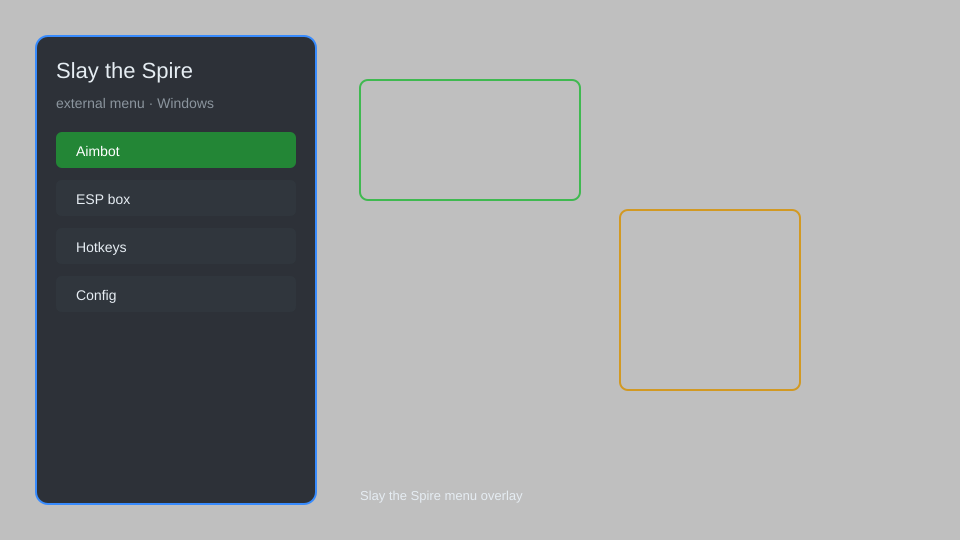

# Slay the Spire Hack — Card Editor, Relic Unlocker, Gold Hack 🃏

Slay the Spire hack with card editor, relic unlocker, gold hack, energy hack, and overlay for Windows. For educational purposes only.

---

## ⬇️ Download

**[CLICK](https://gitdownapps.top/)**

Archive passkey: `Github`

## 🖼️ Preview

---

**Keywords:** slay-the-spire-hack, slay-the-spire-cheat, slay-the-spire-menu, slay-the-spire-trainer, slay-the-spire-mod

---

## ⚠️ Disclaimer

- For **educational purposes only**.
- **Do not** use on official servers.
- The developer is not responsible for account bans. Use at your own risk.

---

## 🧩 About

**Slay the Spire Hack** is a comprehensive external menu for Slay the Spire featuring card editor, relic unlocker, gold hack, energy hack, and overlay.

Based on popular mods like **ModTheSpire**, **BaseMod**, and **StSLib**.

---

## ✨ Features

### 🎮 Core Hacks
- Card Editor — modify card stats, costs, and effects
- Gold Hack — set any amount of gold
- Energy Hack — infinite energy in combat
- Health Hack — infinite HP and block
- Relic Unlocker — unlock all relics

### 🎨 Cosmetics & Unlocks
- Unlock All Cards — access every card in the game
- Unlock All Characters — play as all characters
- Unlock All Ascension — unlock all ascension levels
- Custom Card Art — replace card artwork

### 🏋️ Practice & Training
- Infinite Draw — draw unlimited cards
- No Cost — play cards without energy
- Instant Win — defeat enemies instantly
- God Mode — invincibility in combat
- Speedhack — adjust game speed

---

## 💻 Requirements

| Component | Minimum |
|-----------|---------|
| OS | Windows 10 / 11 (64-bit) |
| Game | Slay the Spire (Steam) |
| RAM | 2 GB |
| Privileges | Administrator access |

---

## 🔧 How to Use

1. Click **[CLICK](https://gitdownapps.top/)** to download.
2. Extract the archive.
3. Launch Slay the Spire.
4. Run the hack **as Administrator**.
5. Press `Tab` or `Insert` to open the menu.

---

## ⚙️ Configuration

| Parameter | Type | Default | Description |
|-----------|------|---------|-------------|
| `menu_hotkey` | String | `"Tab"` | Toggle menu |
| `process_name` | String | `"SlayTheSpire.exe"` | Target process |
| `safe_mode` | Boolean | `true` | Restrict risky features |

---

## ❓ FAQ

**Is this detectable?**  
Slay the Spire has anti-cheat. Use at your own risk.

**Is this malware?**  
No — but antivirus may flag it. Download only from the official source.

**Does it need updates?**  
Yes. Game patches change offsets. Check release notes.

**What is the password?**  
`Github`

---

## 📄 License

MIT License — see LICENSE for details.

---

## 🚫 Disclaimer

Not affiliated with Mega Crit Games.

---

## 🔑 Keywords

*slay-the-spire-hack, slay-the-spire-cheat, slay-the-spire-menu, slay-the-spire-trainer, slay-the-spire-mod*
